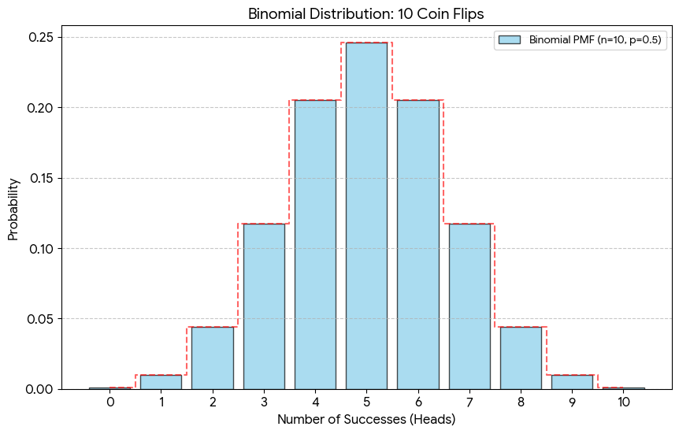
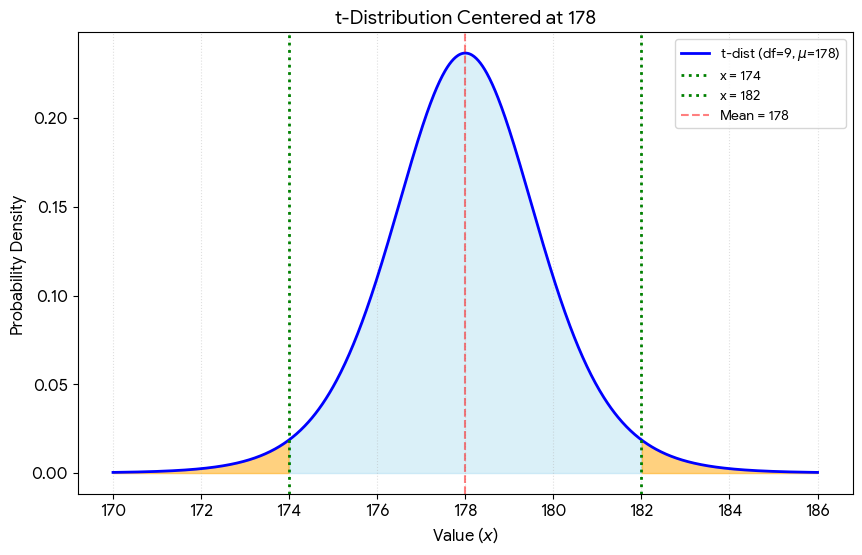
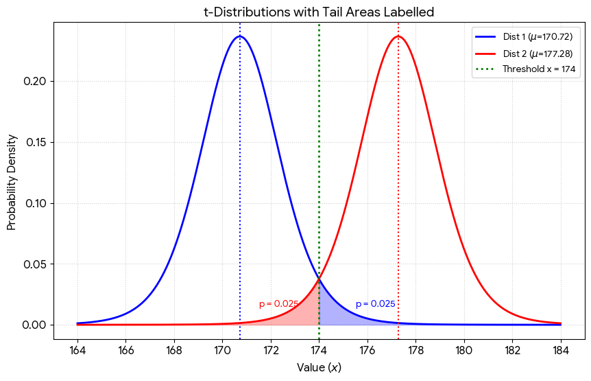
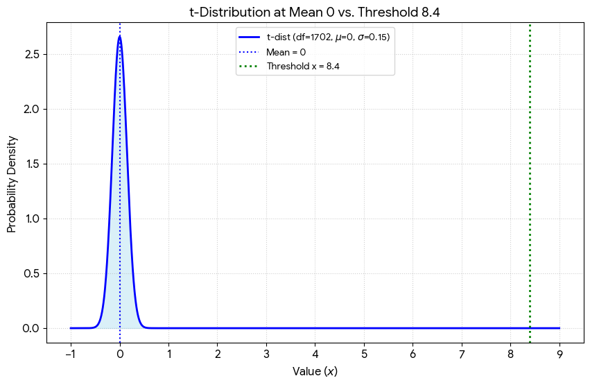
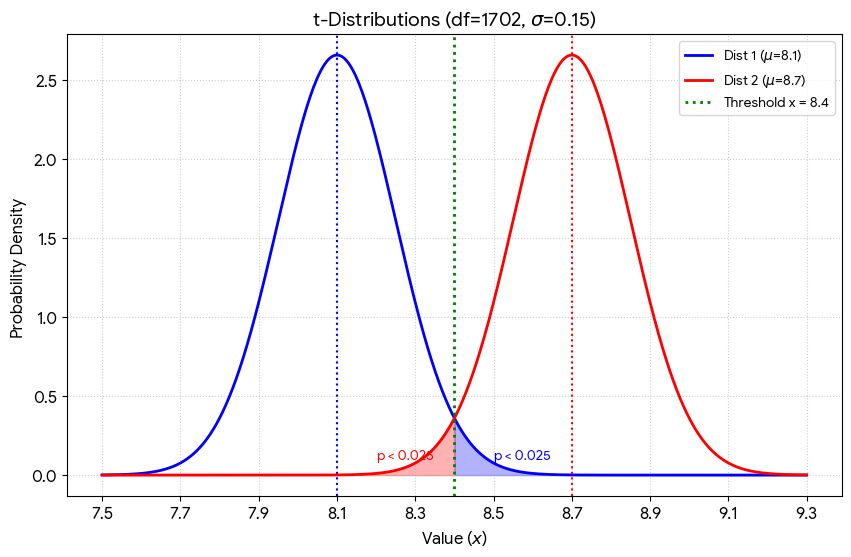

## Plan for Today

1\) "Bell Ringer"

2\) Single Variable Proportions

3\) Single Variable Means

4\) Regression Inference

5\) Regression Assumptions

## Packages

```{r}
library(gapminder)
library(dplyr)
library(ggplot2)
```

## Bell-Ringer

The polling firm Morning Consult fielded a poll of 1000 Americans and found that 47.3% supported the war in Iran. Based on the sample size and result, it reported a 95% confidence interval of 3.1%.

A reporter confronts Donald Trump about the poll and Trump says "Fake news. Most Americans support the war. This poll can't disprove that. You're a very nasty and bad journalist."

Apart from the gratuitous insults, is President Trump correct in his assessment of the poll?

# Single Variable Proportions

## Is the Trump Coin "Fair"?

-   Let's flip it 10 times...

    ```{r}
    n = 10
    heads = 6
    tails = n-heads
    ```

-   Based on this outcome, what is the probability that the coin is fair?

-   What can we say instead?

    ```{r}
    nullcondition <- .5
    ```

## Hypothesis Testing and Confidence Intervals

-   **Hypothesis Testing**: If the real value is \[some null condition\], what is the probability of getting data that look like ours, or more extreme? (If p \< 0.05, we will conclude that the null condition is extremely unlikely; if \> 0.05, we won't be able to rule it out)

-   **Confidence Interval**: This approach instead asks what is the range of null conditions that I would not be able to reject based on the sample? (i.e. where the probability of getting data that look like ours is at least 0.05)

## Turn to Known Distribution



## Calculate p-value From Distribution

-   what is the probability of flipping heads as many times as we did, if the probability of flipping heads each time = .5?

    ```{r}
    right.tail <- pbinom(heads - 1, size = n, prob = nullcondition, lower.tail = F)
    right.tail
    ```

-   what is the probability of the reverse result? (tails as many times as we did)

```{r}
left.tail <- pbinom(tails, size = n, prob = nullcondition, lower.tail = T)
left.tail
```

## P-Value

-   what is the joint probability? (a result as extreme as ours) THIS IS THE P-VALUE

    ```{r}
    pvalue <- right.tail + left.tail
    pvalue
    ```

-   The probability of flipping a fair coin 10 times and getting a result like `{r} heads` heads or one more extreme is `{r} pvalue`

-   The p-value is the probability of drawing a sample like the one you got (or one more extreme) if the null hypothesis were true.

# Single Variable - Means

## Grad Student heights

-   What is the average height of the POLS 642 class

    ```{r}
    heights <- c(165, 177, 180, 172, 179, 177, 169, 175, 178, 168)
    avg.height <- mean(heights)
    avg.height
    ```

-   Assuming y'all are a random sample, what is the probability that the average height of all NIU graduate students is 178cm?

## Central Limit Theorem

-   What if we don't know the distribution of the population? e.g. graduate student heights

-   No problem, because of the Central Limit Theorem, we know that distribution of sample means will follow a normal distribution, centered at the population mean and with standard error of $\frac{\sigma}{\sqrt{n}}$

-   Don't know $\sigma$? No problem, substitute the sample standard deviation and use the t-distribution to account for this increased uncertainty

## Key Stats

-   n = number of observations = 10

-   $\bar{X}$ = sample mean of X:

    ```{r}
    avg.height <- mean(heights)
    avg.height
    ```

-   s = sample standard deviation of X:

    ```{r}
    sd.height <- sd(heights)
    sd.height
    ```

-   se = estimate of the standard error of the sampling distribution of X

    ```{r}
    st.error.height <- sd.height/sqrt(10)
    st.error.height
    ```

## T-Distribution



## Hypothesis Test

-   we want to find the area of those yellow areas

-   left-hand side:

    ```{r}
    t.stat.lower <- (174-178)/st.error.height #how many standard errors away is our sample mean from the null condition? 2 is the magic number
    t.stat.lower
    pleft <- pt(t.stat.lower, n-1)
    pleft
    ```

-   right-hand side:

```{r}
t.stat.upper <- (182-178)/st.error.height
t.stat.upper
pright <- 1-pt(t.stat.upper, n-1)
pright
```

## Add Them

```{r}
pleft+pright
```

## Confidence Intervals

-   okay, so we can reject the null hypothesis that the population average height is 178cm

-   what if we wanted to know the range of null hypotheses that we would NOT be able to reject? (i.e. the range of possible population means from which are sample is reasonably likely?)

-   This will be our sample average $\pm$ 2 \* standard error

-   174 $\pm$ 2 \*1.64 = 170.72 to 177.28

## Visually

##  

# Inference with Regression

## Similar to means

-   Just like sample means, OLS regression coefficients (slopes, $\hat{\beta_1}$), will approximate a normal distribution, centered on the "real" population slope ($\beta_1$)

-   The variance of that distribution of sample coefficients can be estimated through the expression:

    $$\hat{\sigma} ^2 = \frac{\sum_{i=1}^N (Y_i - \hat Y_i)^2}{(N-k)(N*var(X)}$$

## Applying with the T-Distribution

-   Like with means, we will need to resort to the t-distribution as we are estimating the variance of the sampling distribution based on the sample

-   Our null hypothesis will always be that $\beta_1 = 0$

## Let's take our Gapminder Model

```{r}
gap.model <- lm(lifeExp~log(gdpPercap), data = gapminder)
summary(gap.model)
```

## Visualizing the Null Distribution



## Null Hypothesis Test

-   what is the probability of drawing a sample with a slope of 8.4 if the real slope were 0?

-   mathematically, what is the probability under a t-distribution with 1702 degrees of freedom of values that are 56.5 standard errors away from the mean in either direction?

```{r}
2 * pt(-56.5, 1702)
```

## The magical number 2

-   a useful rule of thumb is that 95% of observations in a normal or t distribution fall within about 2 standard deviations from the mean

    ```{r}
    2* pt(-2,100)
    ```

-   so when our t-stat is greater than 2, we can reject the null

## Confidence Intervals for OLS coefficients

-   we can also use our estimate $\pm$ 2 \* standard error to construct confidence intervals

-   8.4 $\pm$ 2\*0.15 = 8.1 to 8.7

-   Our result, a slope of 8.4, would be reasonably likely if the real slope is anywhere between 8.1 and 8.7

## Visualizing Confidence Intervals



# Assumptions

## A Big BUT!

-   the previous slide only holds when certain assumptions are met! Those assumptions are:

    -   Linearity: there is a linear relationship between X and Y (after transformations)

    -   Independence of Errors: Errors are not correlated with X, the prior observations error, or any grouping of the data

    -   Normality of errors: errors follow a normal distribution

    -   Equal variance of errors: errors are similar in magnitude across the entire range of X

## When it goes wrong

-   what happens if we don't take the log of GDP?

```{r}
coef_results <- data.frame(intercept = numeric(1000), gdpPercap = numeric(1000))
for (i in 1:1000){
  sample <- sample_n(gapminder, 300)
  model <- lm(lifeExp~gdpPercap, data = sample)
  coef_results[i,] <- coef(model)
}
```

## Histogram

-   this is NOT normal

```{r}
hist(coef_results$gdpPercap)
```

## Fixing with Transformations

```{r}
coef_results <- data.frame(intercept = numeric(1000), gdpPercap = numeric(1000))
for (i in 1:1000){
  sample <- sample_n(gapminder, 300)
  model <- lm(lifeExp~log(gdpPercap), data = sample)
  coef_results[i,] <- coef(model)
}
```

## Revised Histogram

-   much better

```{r}
hist(coef_results$gdpPercap)
```
