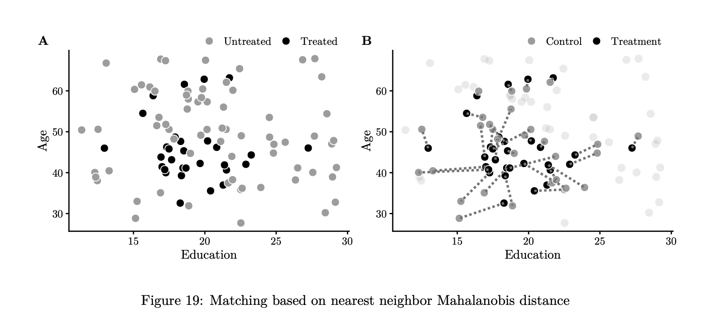

## Plan for Today

1\) "Bell Ringer"

2\) Causality Review

3\) Matching in Theory

4\) Matching in Practice

## Packages

```{r}
#install.packages("ggdag")
library(ggdag)
library(ggplot2)
library(modelsummary)
#install.packages("MatchIt")
library(MatchIt)
#install.packages("flextable")
library(flextable)
```

## Bell-Ringer

Which variables should we control for?

```{r, echo = F}
mosquito_dag <- dagify(
malaria_risk~ net + income + health + temperature + resistance + bites,
net~ income + health + temperature,
bites ~ net,
mortality ~ malaria_risk + income + health,
health~ income,
exposure = "net",
outcome = "malaria_risk",
coords = list(x = c(malaria_risk = 7, net = 3, income = 4, bites = 5, health = 5,
temperature = 6, resistance = 8.5, mortality = 8.5),
y = c(malaria_risk = 2, net = 2, income = 3, health = 1,
temperature = 3, bites = 2, resistance = 3, mortality = 1)),
labels = c(malaria_risk = "Risk of malaria", net = "Mosquito net", income = "Income",
health = "Health", bites = "Mosquito bites", temperature = "Nighttime temperatures",
resistance = "Insecticide resistance", mortality = "Mortality")
)

ggdag_status(mosquito_dag, use_labels = "label", text = FALSE) +
theme_dag()
```

# Causality

## The Problem of Endogeneity

-   in order to infer causality, we must assume that the treatment and control groups are identical in all ways that might affect the outcome

-   *endogeneity* refers to any theoretical process that might make this assumption untrue. It usually takes one of two forms:

-   Reverse causality: Y causes X

-   Omitted Variable Bias (OVB) or a confounding variable: a third variable Z causes both X and Y

## Example

-   as publicly-funded but privately-run "charter schools" became widespread in the United States, policymakers and citizens wanted to know whether they produced better outcomes than public schools

-   First, analysts compared the test scores of students in public schools versus charter schools. They were higher in charter schools!

-   Charter schools were associated with higher test scores. But did they *cause* those higher test scores?

## Confounding Variables

A confounding variable is any variable that:

1\) affects the likelihood of receiving treatment $X$ , AND

2\) affects the outcome $Y$

```{r, echo = F}
ggdag_confounder_triangle() + theme_dag()
```

## The Confounder

-   in the case of charter schools, greater *family income* might make students more likely to choose a charter school AND more likely to achieve higher test scores

    ```{r, echo = F}

    ggdag_confounder_triangle() + theme_dag()
    ```

## The Problem

-   our treatment and control groups are not identical in a way that likely affects test scores

-   the higher average test scores for charter school students may be the result of the treatment group's higher average family income, rather than the result of charter schools

-   our results are biased because of an omitted confounding variable: family income

## The Solutions

1\) Experimental research designs (Randomized Controlled Trials or RCTs)

2\) Multivariate Regression: adding additional variables to a regression as "controls"

3\) Quasi-experimental approaches (instrumental variables, difference-in-differences, regression discontinuity designs, **matching methods**)

# Experiments

## Experiments: The Beauty of Randomization

-   when you are able to randomize treatment, you know you should have two groups – treatment and control – that should be, on average, identical in all observed and unobserved pre-treatment characteristics

-   that is, you can assume that the treated and untreated observations are similar with respect to all the variables that might affect the outcome other than the treatment itself

## Charter School "Lotteries"

-   Researchers looked at charter schools that had held random lotteries to determine who got in.

-   Comparing the students who "won" the lottery and entered the charter school to those who "lost" the lottery and went to public school

-   The lottery created *randomized treatment*, ensuring that the treatment and control groups were identical

-   Most studies using this approach have shown no causal effects for charter schools

## Drawbacks of Experiments

-   Ethics: is it fair to deny some people treatment? or to apply a treatment when the result is unknown and potentially dangerous?

-   Logistics: some things just can't be randomly assigned

-   Financial: experiments are expensive

So if we can't do an experiment, what can we do instead?...

## Multiple Linear Regression

1\) Identify all potential confounding variables

2\) Add potential confounders as additional $X$ variables in a regression model, and model them correctly (transformations, etc...)

## Limitations

-   can we ever truly know that we have included all potential confounders or that we have modeled them correctly??

-   don't want to include *post-treatment* variables: those that might be caused by our treatment

## Mediators

-   these are intervening variables, part of HOW X causes Y

-   e.g. teacher quality or hours studied might be mediators in our charter school example

-   We do NOT want to control for these

```{r, echo = F}
ggdag_mediation_triangle() + theme_dag()
```

## Colliders

-   variables that are caused by both X and Y

-   e.g. college acceptance would be a collider

-   We do NOT want to control for these

```{r, echo = F}
ggdag_collider_triangle() + theme_dag()
```

## Best Practices in Multivariate Regression

-   be careful with the language you use

-   clearly specify potentially confounding variables and cite sources to back up

-   maybe even include causal diagram

-   explicitly discuss risks and sources of omitted variable bias

-   sensitivity analysis

## Toward causation in observational studies

-   Other techniques might allow us to relax some of these assumptions

-   **Matching methods** do not require perfect linearity of confounding variables

-   Fixed Effects will allow us to control for whole sets of possible confounding variables that are in turn correlated with groups in our data

-   Instrumental variables will allow us to find plausibly random variation in our independent variables

# Matching in Theory

## The Problem ...revisited

-   our treatment and control groups are not identical in a way that likely affects test scores

-   what if we adjusted the control group to make it more similar to the treatment group?

## Approach #1: Weighting

-   let's say our treatment group had 80% boys and 20% girls

-   we could "weight" the control group, so that it has the same breakdown

-   i.e. you compare the average outcome of the treatment group to a weighted average of the control

-   you can do this across multiple confounding variables, it just makes the math harder

## Approach #2: 1 to 1 Matching

-   for each observation in the treatment group, you could find an observation(s) in the control that are most similar across a set of confounding variables

-   you can then take the average difference in outcomes between the treated and untreated observations within each pair

-   e.g. "match" a high income boy who went to charter school to a high income boy who did not go to charter school

## How do you match?

-   Simple version: you use the same set of confounders that you would otherwise put into a regression to either weight or match observations

-   Complex version: there are lots of decisions to make in the mathematics behind the matching and weighting

-   Best advice: find a recent article in your area of study where this has been done and follow their approach

## Nearest Neighbor Visualized



## Analysis

-   after you match or weight, you still need to compare the "treatment" and "control"

-   you can just compare the mean outcomes (t-test of means)

-   or you can plug it into a regression with weights or matched pairs

## Benefits of Matching

-   does not rely on some of the assumptions of OLS regression, especially linearity

-   an intuitive approach to dealing with "imbalance" or selection effects in treatment

-   can also be helpful for qualitative/mixed research

## Drawbacks of Matching

-   you need a binary independent variable

-   it's still not causation!! it does not solve the underlying problem of unmeasured confounding variables

-   it adds complexity in terms of matching algorithms

-   the results are either the same as regression...or they're different...

# Matching in Practice

## Heiss Mosquito Nets

```{r, echo = F}

mosquito_dag <- dagify(
malaria_risk~ net + income + health + temperature,
net~ income + health + temperature,
health~ income,
exposure = "net",
outcome = "malaria_risk",
coords = list(x = c(malaria_risk = 7, net = 3, income = 4, health = 5,
temperature = 6),
y = c(malaria_risk = 2, net = 2, income = 3, health = 1,
temperature = 3)),
labels = c(malaria_risk = "Risk of malaria", net = "Mosquito net", income = "Income",
health = "Health", temperature = "Nighttime temperatures")
)

ggdag_status(mosquito_dag, use_labels = "label", text = FALSE) +
theme_dag()
```

## Load the Data

```{r, echo = F}
mosquito_nets <- read.csv("https://evalsp22.classes.andrewheiss.com/data/mosquito_nets.csv")

head(mosquito_nets)
```

## Simple Comparison

```{r, echo = F}
ggplot(mosquito_nets, aes(x = net, y = malaria_risk)) +
geom_boxplot() + 
  theme_bw()
```

## Naive/Unadjusted Model

```{r}
model_naive <- lm(malaria_risk~ net, data = mosquito_nets)
modelsummary(list( "Naive" = model_naive), stars = T, gof_map = c("r.squared","nobs"), output = "flextable") %>% autofit()
```

## Add Controls

```{r, echo = F}
model_regression <- lm(malaria_risk~ net + income + temperature + health,
data = mosquito_nets)
modelsummary(list( "Naive" = model_naive, "Multivariate" = model_regression), stars = T, gof_map = c("r.squared","nobs"), output = "flextable") %>% autofit()
```

## Matching using Nearest Neighbor

```{r}
matched <- matchit(net~ income + temperature + health, data = mosquito_nets,
method = "nearest", distance = "mahalanobis", replace = TRUE)
mosquito_nets_matched <- match.data(matched)
head(mosquito_nets_matched)
```

## Run Matched Regression

```{r}
model_matched <- lm(malaria_risk~ net, data = mosquito_nets_matched,
weights = weights)
modelsummary(list( "Naive" = model_naive, "Multivariate" = model_regression, "Matched" = model_matched), stars = T, gof_map = c("r.squared","nobs"), output = "flextable") %>% autofit()
```

## Conclusion

-   Matching allows you to apply an experimental logic of treatment and control to observational data

-   It's only as good as your measured confounding variables

-   It does relax some of the OLS assumptions about linearity of confounders

-   It's results are often similar to multivariate regression... and if they are not, which do you trust?
