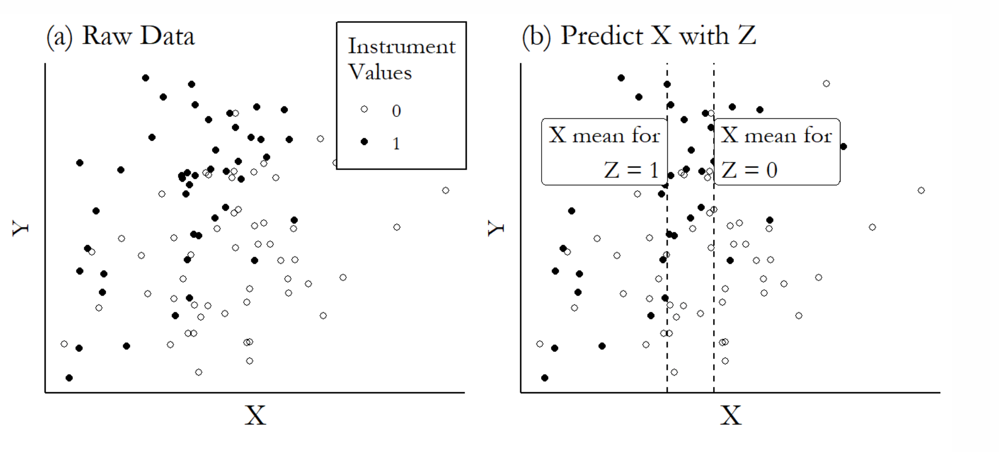
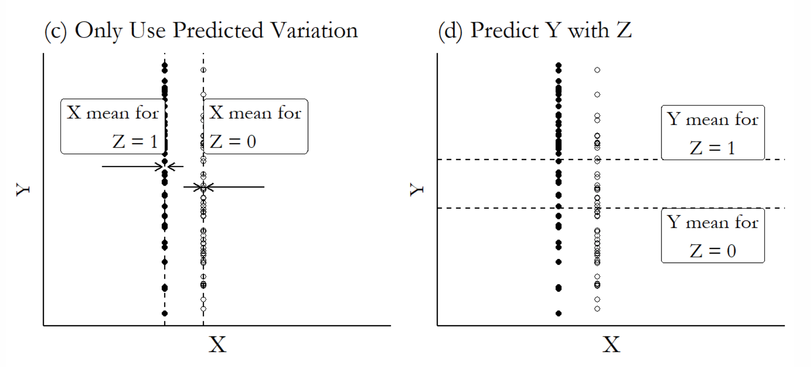
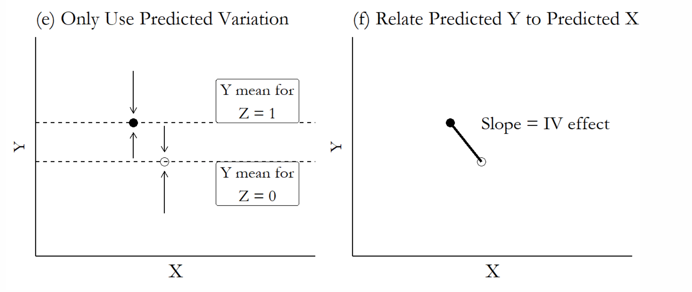

## Plan for Today

1\) Presentation Sign-ups

2\) Causal Inference Recap

3\) Instrumental Variables

4\) Two-Stage Least Squares

## Packages

```{r}

library(modelsummary)
library(fixest)
library(flextable)
library(causaldata)


```

## Bell-Ringer

I am studying the relationship between different types of regime transitions and democratization (measured with VDEM scores). My units of observation are country-years. How might I handle the time-dependent nature of democracy scores? (Many different correct answers)

# Causal Inference Recap

## The Problem of Endogeneity

-   in order to infer causality, we must assume that the treatment and control groups are identical in all ways that might affect the outcome

-   *endogeneity* refers to any theoretical process that might make this assumption untrue. It usually takes one of two forms:

-   Reverse causality: Y causes X

-   Omitted Variable Bias (OVB) or a confounding variable: a third variable Z causes both X and Y

## The Solutions

1\) Experimental research designs (Randomized Controlled Trials or RCTs)

2\) Multivariate Regression: adding additional variables to a regression as "controls", including fixed effects

3\) Quasi-experimental approaches (**instrumental variables**, difference-in-differences, regression discontinuity designs, matching methods)

# Closing Back Doors

## Closing Back Doors

-   causal inference strategies that rely on blocking paths from confounding variables to the independent variable

-   multivariate regression, matching, fixed effects, difference-in-differences

## Multivariate Regression

-   **Data Needs**: None! can use on any kind of data

-   **Strengths:** Flexibility, could hypothetically isolate a causal effect if we have no omitted confounding variables and we model correctly

-   **Limitations:** This is a heroic assumption!

## Matching

-   **Data Needs:** Binary independent variable?

-   **Strengths:** Follows intuition of an experiment, does not require assumption of modeling correct functional form of covariates

-   **Limitations:** It's not actually an experiment! You still need to assume that you have no omitted variables in your matching process

## Fixed Effects

-   **Data Needs:** Panel Data

-   **Strengths:** Effectively controls for all omitted variables that are correlated with group and/or time

-   **Limitations:** Requires substantial in-group variation, doesn't account for omitted variables not correlated with groups or time

## Difference in Difference

-   **Data Needs:** Panel Data with binary treatment

-   **Strengths:** Cross-group, over-time comparisons can really reduce risk of omitted variable bias

-   **Limitations:** Does not fully eliminate risk of OVB, has strng assumptions of its own (e.g. parallel trends)

## Overall Assessment

-   this suite of methods provides powerful tools to reduce risk of endogeneity/omitted variable bias

-   But they often can only be used on certain types of data, and carry additional assumptions of their own

-   I would **NOT** use the language of causality with these methods, simply that they reduce risk of OVB

-   Often use in conjunction with multivariate regression

# Opening Front Doors

## Opening Front Doors

-   causal inference strategies that rely on identifying a source of exogenous variation in the independent variable

-   experiments, natural experiments, **instrumental variables**


## Experiments

-   **Data Type:** experimental

-   **Strengths:** really strong internal validity, causal inference

-   **Limitations:** weak external validity, experiments often not possible

## Natural Experiments

-   when something naturally happened in history that created exogenous variation in our IV of interest (e.g. natural disasters, accidents of history)

-   **Strengths:** can allow us to make causal claims

-   **Limitations:** hard to find, need to demonstrate that really created exogenous variation

# Instrumental Variables

-   like natural experiments, but when we think natural randomization is partial (i.e. increased likelihood of treatment on a population, but did not determine entirely)

-   **Strengths:** can allow us to make causal claims in a wider variety of settings

-   **Limitations:** can be hard to find an "instrument," and has some important assumptions

## Example

-   What is the effect of voter turnout and political party performance?

-   voters preferences/attitudes likely affect both turnout and results

-   rainfall can be used as an instrument that partially explains turnout

## Procedure

1\) Use the instrument to explain the treatment (IV \~ Instrument)

2\) Remove any part of the treatment that is **NOT** explained by the the instrument

3\) Use the instrument to explain the outcome

4\) Remove any part of the outcome that is **NOT** explained by the treatment

5\) Look at the relationship between the instrument-explained part of the outcome and the instrument-explained part of the treatment

## Steps 1 and 2



## Steps 3 and 4



## Step 5



## Assumptions

1\) **Relevance:** The instrument, Z, needs to explain a substantial part of X

2\) **Validity:** Z does not affect Y in any way other than through X

# Two Stage Least Squares

## 2SLS

-   two stages of regressions to estimate an instrumental variables model

-   **Stage 1:** Fit a regression model explaining the treatment variable with the instrument (X \~ Z)

-   **Stage 2:** Use the predicted values of X from Stage 1 (rather than actual values), to explain Y (Y \~ $\hat{X}$)

## Textbook Example

-   Individuals were assigned to a treatment or control seminar about insurance. In the treatment seminar, the default option was that they would buy insurance, unless they opted out

-   Whether the individual purchased insurance is the treatment in this study

-   The DV is whether their friends bought insurance

## 2SLS with Insurance

-   **Stage 1:** Regression of the probability an individual buys insurance based on whether or not they were in the treatment seminar

-   **Stage 2:** Regression of the probability a friend buys insurance, based on the predicted probability that their friend in the study bought insurance (based on whether they were in the treatment group)

## Coding it

```{r}
d <- causaldata::social_insure

# Include just the outcome and controls first, then endogenous ~ instrument 
# in the second part, and for this study we cluster on address
m <- feols(takeup_survey ~ male + age + agpop + ricearea_2010 +
            literacy + intensive + risk_averse + disaster_prob +
            factor(village) | pre_takeup_rate ~ default, 
            cluster = ~address, data = d)
```

## Outcome

```{r, echo = F}

msummary(list('First Stage' = m$iv_first_stage$pre_takeup_rate,
                'Second Stage' = m),
                coef_map = c(default = 'First Round Default',
                fit_pre_takeup_rate = "Friends' Purchase Behavior"),         
                stars = c('*' = .1, '**' = .05, '***' = .01), gof_map = c("nobs", "r.squared", "vcov.type"))

```

## A Caution About Rainfall

"I show that the use of weather to instrument different independent variables represents strong prima facie evidence of exclusion-restriction violations for all weather-IV studies. A review of 289 studies reveals 194 variables previously linked to weather: all representing potential exclusion-restriction violations."

-   Mellon (2024)

## Conclusion

-   Instrumental variables techniques are really popular because they present possibly the most compelling way to make causal claims in the context of an observational study

-   They sound really complicated, but in practice can be fairly easy to implement

-   BUT, finding instruments that meet the relevance and validity assumptions is really hard
